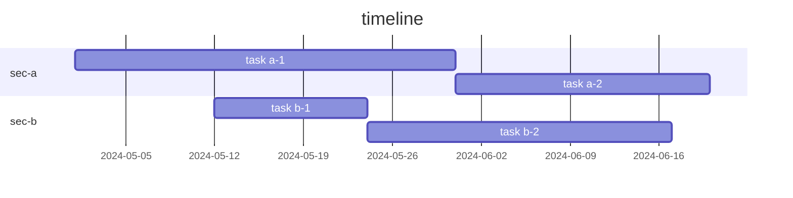

.

mermaid 로 간트차트를 만들 수 있었네?  
플러그인 찾아 헤맸는데, 이렇게 구현할 수 있었다.  

```(mermaid)
gantt
    title timeline
    dateFormat YYYY-MM-DD
    section sec-a
        task a-1        :a1, 2024-05-01, 30d
        task a-2        :after a1, 20d
    section sec-b
        task b-1  :2024-05-12, 12d
        task b-2 :24d
```




## ref.

- 옵시디언 심화: 간트 차트(Gantt Chart) (tistory.com) | [Link](https://kaminik.tistory.com/entry/%EC%98%B5%EC%8B%9C%EB%94%94%EC%96%B8-%EC%8B%AC%ED%99%94-%EA%B0%84%ED%8A%B8-%EC%B0%A8%ED%8A%B8Gantt-Chart) 
