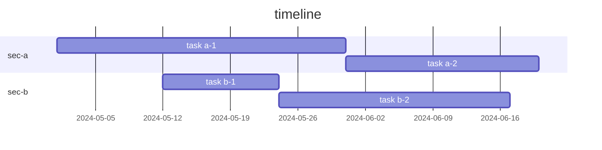
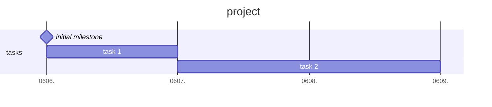
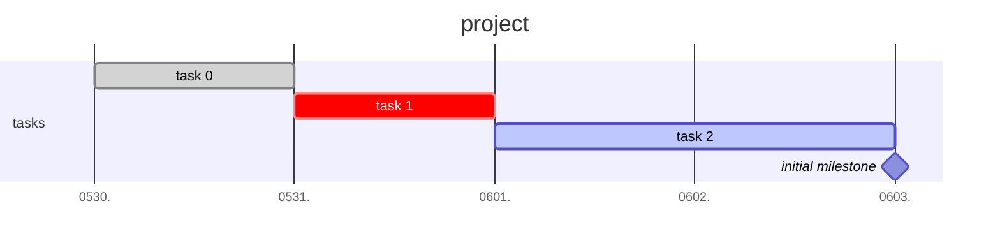

.

mermaid 로 간트차트를 만들 수 있었네?  
플러그인 찾아 헤맸는데, 이렇게 구현할 수 있었다.  

```(mermaid)
gantt
    title timeline
    dateFormat YYYY-MM-DD
    section sec-a
        task a-1        :a1, 2024-05-01, 30d
        task a-2        :after a1, 20d
    section sec-b
        task b-1  :2024-05-12, 12d
        task b-2 :24d
```




### milestone & tick interval

`milestone` 옵션으로 마일스톤을 표시할 수 있다.  
간격 구분선은 자동으로 잡히는데,  
기간이 짧은 경우 하루를 여러 간격 구분선으로 나뉜다.  
이럴 때, `tickInterval` 옵션을 주면, 하루 간격으로 구분된다.  

```
gantt
    title project
    dateFormat YYYY-MM-DD
    axisFormat %m%d.
    tickInterval 1day
    section tasks
	    initial milestone  :  milestone, m1, 2024-06-06, 1s
        task 1  : t1, 2024-06-06, 1d
        task 2  : t2, after t1, 2d
```




### active, done, crit

마일스톤처럼 특정 표시를 할 수 있다.  

- `done` : 완료
- `crit` : 중요
- `active` : 진행

```
gantt
    title project
    dateFormat YYYY-MM-DD
    axisFormat %m%d.
    tickInterval 1day
    section tasks
	    task 0  : done, t0, 2024-05-30, 1d
        task 1  : crit, t1, 2024-05-31, 1d
        task 2  : active, t2, after t1, 2d
	    initial milestone  :  milestone, m1, after t2, 1s
```





## ref.

- 옵시디언 심화: 간트 차트(Gantt Chart) (tistory.com) | [Link](https://kaminik.tistory.com/entry/%EC%98%B5%EC%8B%9C%EB%94%94%EC%96%B8-%EC%8B%AC%ED%99%94-%EA%B0%84%ED%8A%B8-%EC%B0%A8%ED%8A%B8Gantt-Chart) 
- Gantt diagrams (Mermaid) | [Link](https://mermaid.js.org/syntax/gantt)

