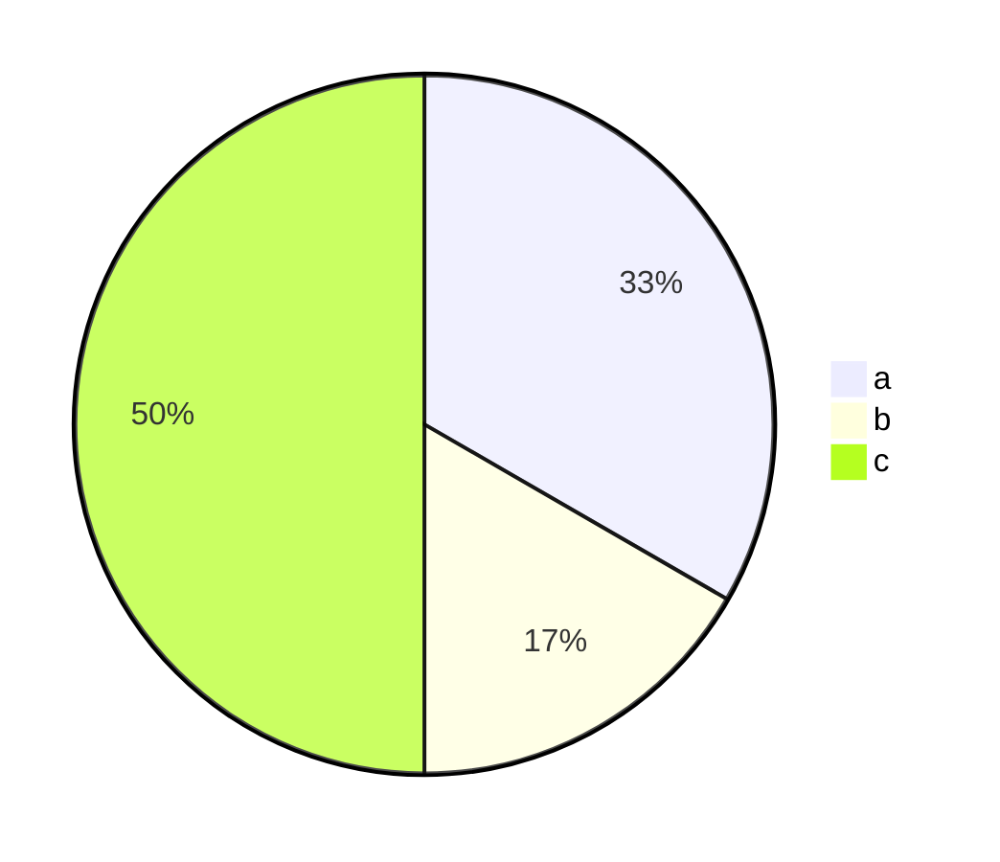

.

다음과 같이 `dataview` 형식으로 작성했을 때,  

```markdown
#test/new

a:: a1
a:: a2
b:: b1
c:: c1
c:: c2
c:: c3
```

`dataviewjs` 으로 `mermaid` 의 `pie` 차트를 그릴 수 있다.  

```
// #test/new 태그에서 노트를 가져옴.
let pages = dv.pages("#test/new");

// dv.paragraph() 함수로 mermaid 형식의 글을 작성
// pages.a.length : a의 크기 반환
dv.paragraph("```mermaid"
    + `\npie\n "a": ${pages.a.length}\n`
    + `\n "b": ${pages.b.length}\n`
    + `\n "c": ${pages.c.length}\n`
    + "```"
)
```

결국 위 코드는 다음과 같은 `mermaid` 코드를 작성하는 것과 같다.    

```
pie
	"a": 2
	"b": 1
	"c": 3
```

pie chart 결과




## ref.

- Is it possible to create Mermaid diagrams from Dataview queries? : r/ObsidianMD (reddit.com) | [Link](https://www.reddit.com/r/ObsidianMD/comments/1c6aaii/is_it_possible_to_create_mermaid_diagrams_from/) 
- 옵시디언 심화: Mermaid (tistory.com) | [Link](https://kaminik.tistory.com/entry/%EC%98%B5%EC%8B%9C%EB%94%94%EC%96%B8-%EC%8B%AC%ED%99%94-Mermaid) 